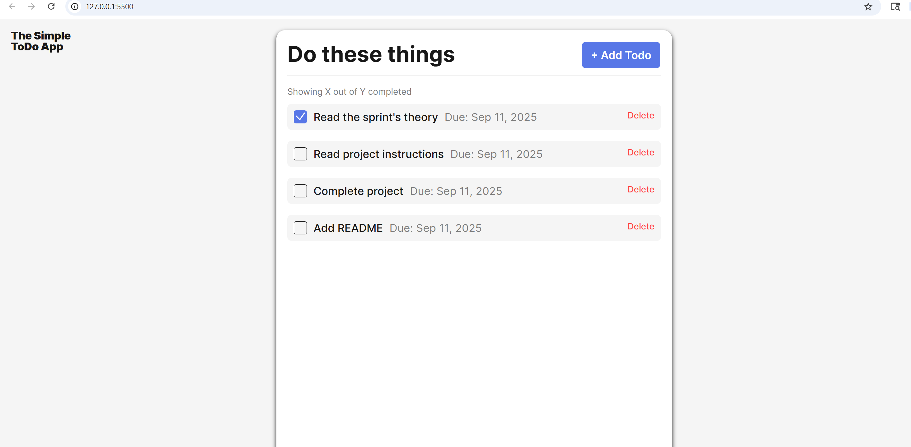

# Simple Todo App

This easy-to-use app simplifies task management, enabling users to add, delete, edit, and track the completion of their to-dos with just a simple click

## Functionality

- Form validation with real-time feedback
- Unique ID generation for new todos
- Clean OOP structure with separate classes
- Date functionality for due dates
- Users can check off completed tasks
- Users can edit, add, or delete a task after creating it
- Users can use the due dates to track and accomplish tasks before they are overdue

## Technology

- JavaScript
- ES6 modules for code organization
- HTML5 and CSS for the interface

## Deployment

This project is deployed on GitHub Pages:

- (https://saulgood04.github.io/se_project_todo-app/)
